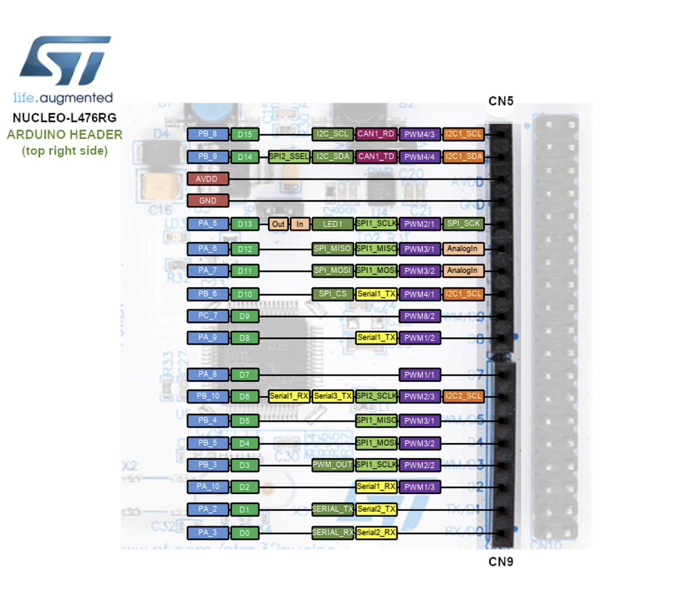

## Pinout Configuration Documentation for STM32L476RG in Permittivity Meter ReDesign

This document details the pinout configuration for the STM32L476RG microcontroller in the Permittivity Meter ReDesign project. The configuration is based on STM32CubeMX settings for the Hardware Layer (HL), supporting data acquisition from the Twin-T notch filter (ADC), varactor control (DAC), Bluetooth communication with NINA-W152 (USART2), button wake-up (GPIO interrupt), and clock output (MCO).

The goal is to create an Arduino-shaped shield with the external circuit (Twin-T notch filter, 7th-order LC filter, OPA2690 stages) that sits on top of the NUCLEO-L476RG. These headers provide a standardized pin layout. Therefor, we will fouces on the Arduino Compatible headers.

### Pinout Summary Table

## Arduino-Compatible Pin Configuration for Permittivity Meter ReDesign

This table details the pin configuration for the STM32L476RG microcontroller on the NUCLEO-L476RG board, designed for an Arduino-shaped shield.

| Arduino Pin | STM32 Pin | Function          | Mode in CubeMX                                      | Rationale                                      | Shield Connection        |
|-------------|-----------|-------------------|----------------------------------------------------|------------------------------------------------|--------------------------|
| A0          | PA0       | ADC (Notch Signal) | ADC1_IN5 Single-Ended (12-bit, continuous, 16x oversampling) | Samples undersampled filter output (~10 kHz) for FFT. | OPA2690 output to A0.    |
| A2          | PA4       | DAC D1 (ε')       | DAC1_OUT1 External Pin (Buffered, S&H)             | Voltage for D1 frequency shift.                 | D1 varactor to A2.       |
| A3          | PA5       | DAC D2 (ε'')      | DAC1_OUT2 External Pin (Buffered, S&H)             | Voltage for D2 Q-factor. Remap from PA5 if SPI conflict. | D2 varactor to A3.       |
| D0 (RX)     | PA3       | USART2_RX         | Asynchronous UART (115200, 8N1)                    | Receives NINA-W152 responses.                   | NINA TX to D0.           |
| D1 (TX)     | PA2       | USART2_TX         | Asynchronous UART (115200, 8N1)                    | Sends AT commands to NINA.                      | NINA RX to D1.           |
| D2          | PA10      | GPIO_EXTI10       | External Interrupt (Falling Edge)                  | Button wake from STOP2.                        | Shield button to D2.     |
| D7          | PA8       | RCC_MCO           | MCO Output (PLLCLK /4 = 20 MHz)                    | Clock for LC filter.                            | Filter input to D7.      |
| D10         | PB6       | GPIO_Output       | Push-Pull                                          | Optional gain switch for OPA2690.               | Amplifier control to D10.|
| +3.3V       | VDD       | Power             | -                                                  | Powers shield components.                       | Multiple +3.3V pins.     |
| GND         | GND       | Power             | -                                                  | Ground plane for shield.                        | Multiple GND pins.       |

### Configuration Rationale
- **Analog Pins (A0, A2, A3)**: Grouped for signal integrity, minimizing noise in the notch filter path.
- **UART Pins (D0, D1)**: Default for USART2, compatible with NINA-W15 per u-connectXpress manual.
- **Interrupt and Control Pins (D2, D7, D10)**: Support low-power wake and filter clocking.
- **Power Pins (+3.3V, GND)**: Multiple connections for stability.

### Pinout View

