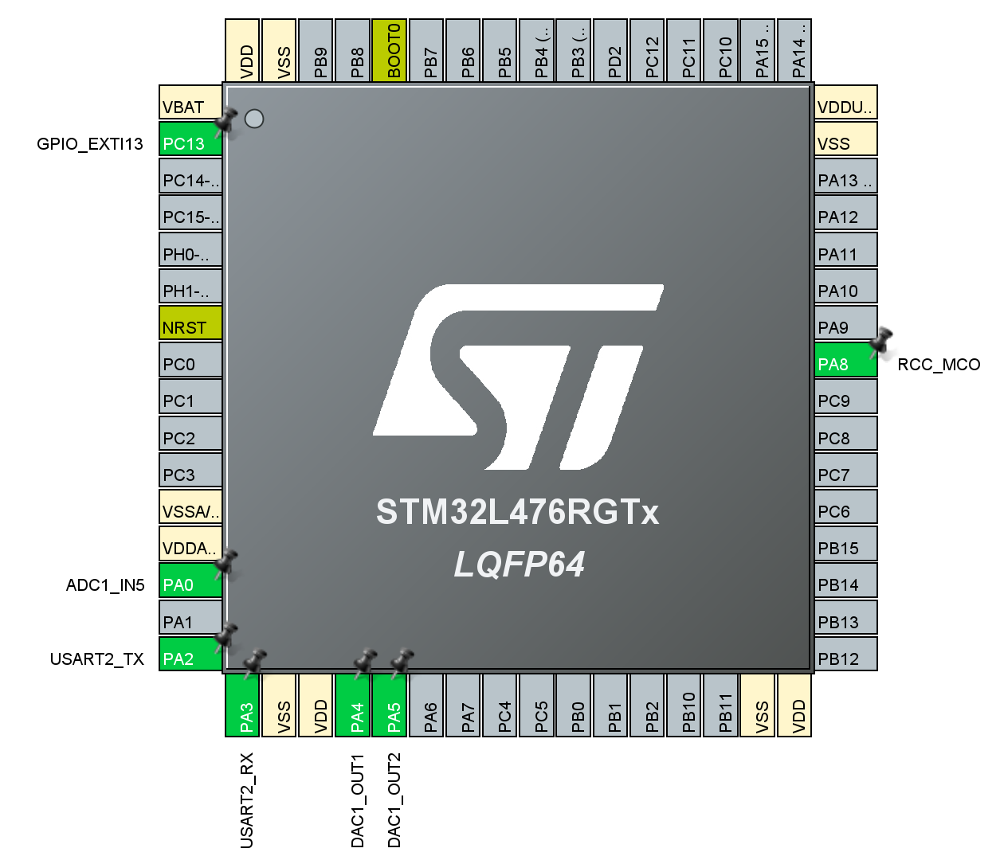
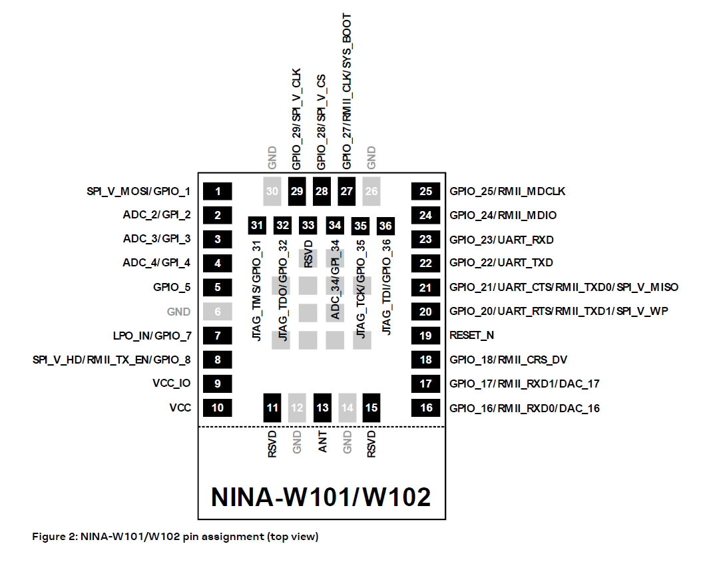
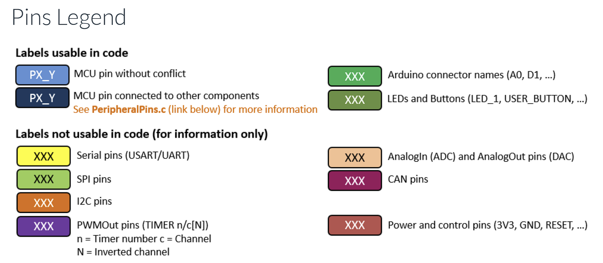

## Pinout Configuration Documentation for STM32L476RG in Permittivity Meter ReDesign

This document details the pinout configuration for the STM32L476RG microcontroller in the Permittivity Meter ReDesign project. The configuration is based on STM32CubeMX settings for the Hardware Layer (HL), supporting data acquisition from the Twin-T notch filter (ADC), varactor control (DAC), Bluetooth communication with NINA-W152 (UART4), button wake-up (GPIO interrupt), and clock output (Timer PWM).

The goal is to create shield with the external circuit (Twin-T notch filter, 7th-order LC filter, OPA2690 stages) using the male pins of the NUCLEO-L476RG. 

## Pinout Mapping Summary Table

### Clock Generation
| Pin | User Label | Function | Signal Type | Connector | Pin # | Specifications | HAL Function | Purpose |
|-----|------------|----------|-------------|-----------|-------|----------------|--------------|---------|
| PA9 | NOCH_20M_IN | TIM1_CH2 | PWM Output | CN10 | 21 | 20 MHz Square Wave, 3.3Vpp, 50% Duty | `HAL_TIM_PWM_Start()` | Drives 7th-order Chebyshev LC filter for sine conversion (THD <1%) |

### Analog Outputs (DAC)
| Pin | User Label | Function | Signal Type | Connector | Pin # | Specifications | HAL Function | Purpose |
|-----|------------|----------|-------------|-----------|-------|----------------|--------------|---------|
| PA4 | FRQ_TN | DAC1_OUT1 | Analog Output | CN7 | 32 | 0-2.5V (amplified to 0-5V) | `HAL_DAC_SetValue()` | Varactor bias for frequency tuning (ε' measurement) |
| PA5 | Q_FACT_TN | DAC1_OUT2 | Analog Output | CN10 | 11 | 0-2.5V (amplified to 0-5V) | `HAL_DAC_SetValue()` | Varactor bias for Q-factor tuning (ε'' measurement) |

### Analog Input (ADC)
| Pin | User Label | Function | Signal Type | Connector | Pin # | Specifications | HAL Function | Purpose |
|-----|------------|----------|-------------|-----------|-------|----------------|--------------|---------|
| PC0 | NOTCH_AMP_IN | ADC1_IN1 | Analog Input | CN7 | 38 | 0-2.5V, 12-bit, 122.5 kHz sampling | `HAL_ADC_Start_DMA()` | Measures notch filter output amplitude (512 samples for FFT) |

### UART Communication (NINA-W152 Bluetooth)
| Pin | User Label | Function | Signal Type | Connector | Pin # | Specifications | HAL Function | Purpose |
|-----|------------|----------|-------------|-----------|-------|----------------|--------------|---------|
| PC10 | NINA_TX | UART4_TX | Digital Output | CN7 | 1 | 115200 baud, 8N1 | `HAL_UART_Transmit()` | Sends AT commands and data to NINA-W152 |
| PA1 | NINA_RX | UART4_RX | Digital Input | CN10 | 34 | 115200 baud, 8N1 | `HAL_UART_Receive()` | Receives responses from NINA-W152 |
| PB7 | - | UART4_CTS | Digital Input | CN7 | 21 | Hardware flow control | Auto | Clear to Send signal |
| PA15 | - | UART4_RTS | Digital Output | CN7 | 17 | Hardware flow control | Auto | Request to Send signal |

### GPIO Control Signals
| Pin | User Label | Function | Signal Type | Connector | Pin # | Initial State | HAL Function | Purpose |
|-----|------------|----------|-------------|-----------|-------|---------------|--------------|---------|
| PC8 | GAIN_SLCT_1 | GPIO Output | Digital Output | CN10 | 2 | Low | `HAL_GPIO_WritePin()` | OPA2690 gain select bit 1 (1x/10x/100x) |
| PC9 | GAIN_SLCT_2 | GPIO Output | Digital Output | CN10 | 1 | Low | `HAL_GPIO_WritePin()` | OPA2690 gain select bit 2 (1x/10x/100x) |
| PC4 | OP_DIS | GPIO Output | Digital Output | CN7 | 34 | Low | `HAL_GPIO_WritePin()` | OPA2690 power-down control (active high) |
| PA11 | NINA_RST | GPIO Output | Digital Output | CN10 | 14 | Low | `HAL_GPIO_WritePin()` | NINA-W152 hardware reset (active low) |
| PA12 | NINA_STOP | GPIO Output | Digital Output | CN10 | 12 | Low | `HAL_GPIO_WritePin()` | NINA-W152 low-power mode control |
| PC12 | NINA_DTR | GPIO Output | Digital Output | CN7 | 3 | Low | `HAL_GPIO_WritePin()` | NINA-W152 data terminal ready |

### Status LEDs
| Pin | User Label | Function | Signal Type | Connector | Pin # | Initial State | Purpose |
|-----|------------|----------|-------------|-----------|-------|---------------|---------|
| PA6 | STATUS_LED | GPIO Output | Digital Output | CN10 | 13 | Low | General system status indicator |
| PA7 | MEAS_LED | GPIO Output | Digital Output | CN10 | 15 | Low | Measurement in progress indicator |
| PC7 | EXCITE_LED | GPIO Output | Digital Output | CN10 | 19 | Low | 20 MHz excitation active indicator |
| PB1 | ERR_LED | GPIO Output | Digital Output | CN8 | 6 | Low | Error state indicator (red) |

### Status Inputs (NINA Module)
| Pin | User Label | Function | Signal Type | Connector | Pin # | Purpose |
|-----|------------|----------|-------------|-----------|-------|---------|
| PC1 | NINA_LED_RED | GPIO Input | Digital Input | CN7 | 36 | NINA module red LED status read-back |
| PC2 | NINA_LED_BLUE | GPIO Input | Digital Input | CN7 | 35 | NINA module blue LED status read-back |
| PC3 | NINA_LED_GREEN | GPIO Input | Digital Input | CN7 | 37 | NINA module green LED status read-back |
| PC11 | NINA_RTS | GPIO Input | Digital Input | CN7 | 2 | NINA-W152 RTS flow control |

### User Interface
| Pin | User Label | Function | Signal Type | Connector | Pin # | Purpose |
|-----|------------|----------|-------------|-----------|-------|---------|
| PC13 | B1 [Blue PushButton] | EXTI13 | External Interrupt | Onboard | - | User button for wake-up / manual trigger |

## ADC Configuration Details
NOTE: Ensure proper grounding and shielding to minimize noise interference during ADC operation. The ADC could be further optimized by selecting appropriate sampling times and input impedance matching.

| Parameter | Value | Notes |
|-----------|-------|-------|
| ADC Instance | ADC1 | Primary ADC peripheral |
| Channel | IN1 (PC0) | Single-ended input from post-amplifier |
| Resolution | 12-bit | 0-4095 digital output |
| Sampling Rate | 122.5 kHz | Undersampling for aliasing to 30.6 kHz |
| Conversion Mode | Continuous | DMA-driven circular buffer |
| DMA Buffer Size | 512 samples | For FFT processing (Radix-2) |
| Clock Source | PLLSAI1 | High-precision clock for stable sampling |
| Trigger | Software | Initiated by `HAL_ADC_Start_DMA()` |
| Data Alignment | Right-aligned | Standard 12-bit format |
| Input Range | 0-2.5V | DC offset at 1.25V from post-amplifier |

# Pinout View

