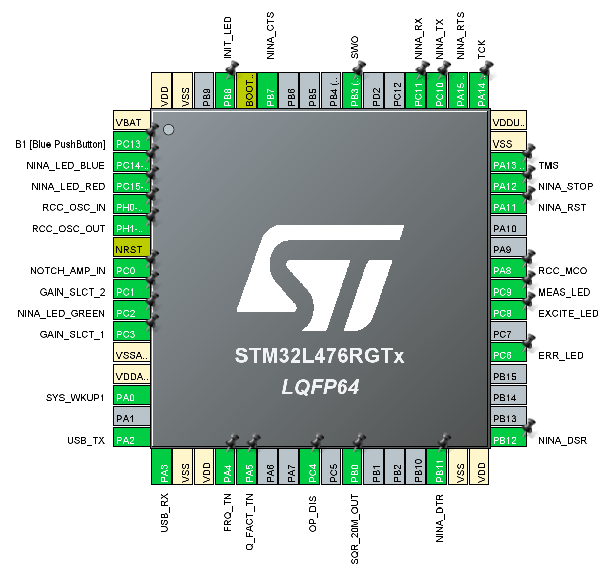
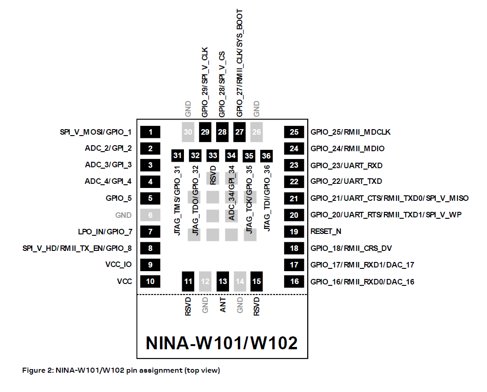
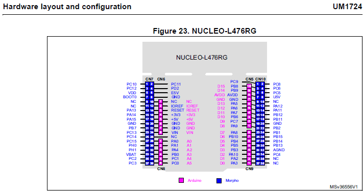
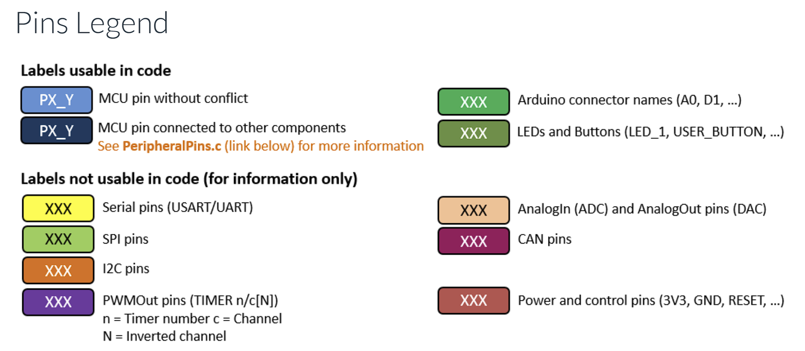
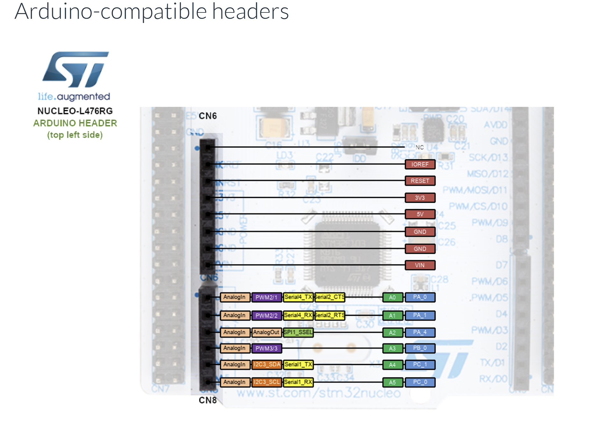
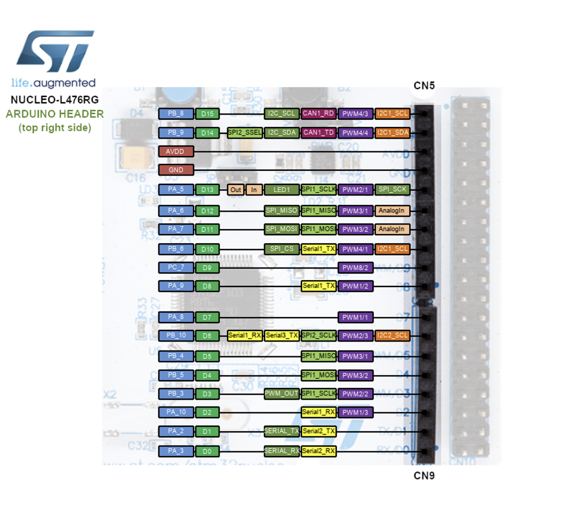
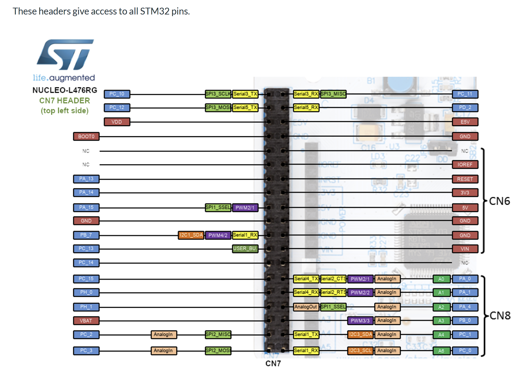
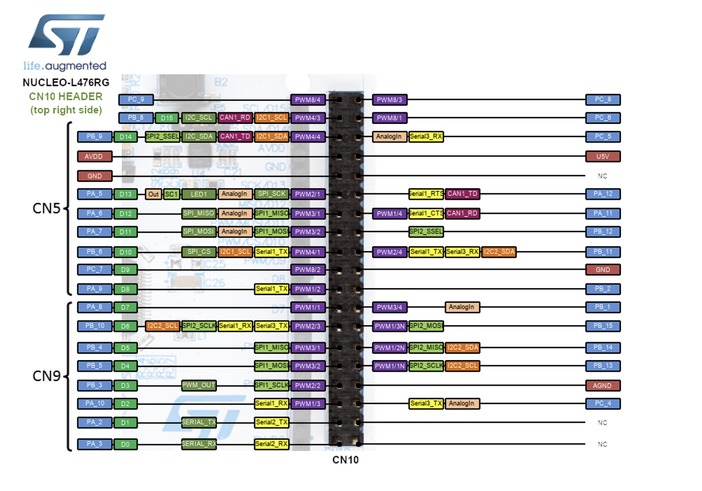

# Pinout Configuration Documentation for STM32L476RG in Permittivity Meter ReDesign

This document details the pinout configuration for the STM32L476RG microcontroller in the Permittivity Meter ReDesign project. The configuration is based on STM32CubeMX settings for the Hardware Layer (HL), supporting data acquisition from the Twin-T notch filter (ADC), varactor control (DAC), Bluetooth communication with NINA-W152 (UART4), button wake-up (GPIO interrupt), and clock output (Timer PWM).

The goal is to create a shield with the external circuit (Twin-T notch filter, 7th-order LC filter, OPA2690 stages) using the male pins of the NUCLEO-L476RG.

> [!IMPORTANT]
> This document is the authoritative reference for hardware team PCB design. All pin assignments match the firmware definitions in `main.h` and `hardware_config.h`.

---

## Complete Pinout Summary

### Clock Generation (PWM)

| Pin | User Label | Function | Signal Type | Connector | Pin # | Specifications | HAL Function | Purpose |
|-----|------------|----------|-------------|-----------|-------|----------------|--------------|---------|
| PA9 | SQR_20M_OUT | TIM1_CH2 | PWM Output | CN10 | 21 | 20 MHz Square Wave, 3.3Vpp, 50% Duty | `HAL_TIM_PWM_Start()` | Drives 7th-order Chebyshev LC filter for sine conversion (THD <1%) |
| PA8 | MCO | MCO Output | Clock Output | CN10 | 23 | HSE clock output (8 MHz) | `HAL_RCC_MCOConfig()` | External clock monitoring/debugging |

---

### Analog Outputs (DAC)

| Pin | User Label | Function | Signal Type | Connector | Pin # | Specifications | HAL Function | Purpose |
|-----|------------|----------|-------------|-----------|-------|----------------|--------------|---------|
| PA4 | FRQ_TN | DAC1_OUT1 | Analog Output | CN7 | 32 | 0-3.3V (amplified to 0-5V externally) | `HAL_DAC_SetValue()` | Varactor bias for frequency tuning (ε' measurement) |
| PA5 | Q_FACT_TN | DAC1_OUT2 | Analog Output | CN10 | 11 | 0-3.3V (amplified to 0-5V externally) | `HAL_DAC_SetValue()` | Varactor bias for Q-factor tuning (ε'' measurement) |

---

### Analog Input (ADC)

| Pin | User Label | Function | Signal Type | Connector | Pin # | Specifications | HAL Function | Purpose |
|-----|------------|----------|-------------|-----------|-------|----------------|--------------|---------|
| PC0 | NOTCH_AMP_IN | ADC1_IN1 | Analog Input | CN7 | 38 | 0-3.3V, 12-bit, DMA-based sampling | `HAL_ADC_Start_DMA()` | Measures notch filter output amplitude (512 samples for FFT) |

---

### Debug/Programming Interface (SWD)

| Pin | User Label | Function | Signal Type | Connector | Pin # | Purpose |
|-----|------------|----------|-------------|-----------|-------|---------|
| PA13 | TMS | SWDIO | Digital I/O | CN7 | 13 | SWD data signal (programming/debug) |
| PA14 | TCK | SWCLK | Digital Input | CN7 | 15 | SWD clock signal (programming/debug) |
| PB3 | SWO | SWO | Digital Output | CN10 | 31 | Serial Wire Output (ITM trace) |

---

### USB/ST-Link UART Communication

| Pin | User Label | Function | Signal Type | Connector | Pin # | Specifications | HAL Function | Purpose |
|-----|------------|----------|-------------|-----------|-------|----------------|--------------|---------|
| PA2 | USART2_TX | USART2_TX | Digital Output | ST-Link VCP | - | 115200 baud, 8N1 | `HAL_UART_Transmit()` | Debug output via ST-Link USB Virtual COM Port |
| PA3 | USART2_RX | USART2_RX | Digital Input | ST-Link VCP | - | 115200 baud, 8N1 | `HAL_UART_Receive()` | Command input via ST-Link USB Virtual COM Port |

---

## NINA-W152 Bluetooth Module Interface

> [!IMPORTANT]
> The NINA-W152 module requires proper control signal sequencing for reliable operation. See the control signal timing diagram below.

### UART Communication (UART4)

| Pin | User Label | Function | Signal Type | Connector | Pin # | Specifications | HAL Function | Purpose |
|-----|------------|----------|-------------|-----------|-------|----------------|--------------|---------|
| PC10 | NINA_TX | UART4_TX | Digital Output | CN7 | 1 | 115200 baud, 8N1 | `HAL_UART_Transmit()` | Sends AT commands and data to NINA-W152 |
| PA1 | NINA_RX | UART4_RX | Digital Input | CN7 | 30 | 115200 baud, 8N1 | `HAL_UART_Receive()` | Receives responses from NINA-W152 |

### Hardware Flow Control

| Pin | User Label | Function | Signal Type | Connector | Pin # | Direction | Purpose |
|-----|------------|----------|-------------|-----------|-------|-----------|---------|
| PB7 | NINA_CTS | UART4_CTS | Digital Input | CN7 | 21 | NINA → MCU | Clear To Send - NINA ready to receive data |
| PA15 | UART4_RTS | UART4_RTS | Digital Output | CN7 | 17 | MCU → NINA | Request To Send - MCU hardware flow control output |
| PC11 | NINA_RTS | GPIO Input | Digital Input | CN7 | 2 | NINA → MCU | NINA RTS signal read-back (NINA's flow control status) |

### Module Control Signals

| Pin | User Label | Function | Signal Type | Connector | Pin # | Initial State | Active Level | Purpose |
|-----|------------|----------|-------------|-----------|-------|---------------|--------------|---------|
| PA11 | NINA_RST | GPIO Output | Digital Output | CN10 | 14 | LOW | Active LOW | Hardware reset (pull LOW to reset, HIGH to run) |
| PA12 | NINA_STOP | GPIO Output | Digital Output | CN10 | 12 | LOW | Active HIGH | Low-power mode control (HIGH = stop, LOW = run) |
| PC12 | NINA_DTR | GPIO Output | Digital Output | CN7 | 3 | LOW | Varies | Data Terminal Ready - wake-up / power control |

### NINA_DSR Signal (Data Set Ready)

| Pin | User Label | Function | Signal Type | Connector | Pin # | Direction | Purpose |
|-----|------------|----------|-------------|-----------|-------|-----------|---------|
| PD2 | NINA_DSR | GPIO Input | Digital Input | CN7 | 4 | NINA → MCU | Data Set Ready - NINA ready/connected status |

### NINA Status LED Read-Back

| Pin | User Label | Function | Signal Type | Connector | Pin # | Purpose |
|-----|------------|----------|-------------|-----------|-------|---------|
| PC1 | NINA_LED_RED | GPIO Input | Digital Input | CN7 | 36 | NINA module red LED status read-back |
| PC2 | NINA_LED_BLUE | GPIO Input | Digital Input | CN7 | 35 | NINA module blue LED status read-back |
| PC3 | NINA_LED_GREEN | GPIO Input | Digital Input | CN7 | 37 | NINA module green LED status read-back |

---

### RF Amplifier Control (OPA2690)

| Pin | User Label | Function | Signal Type | Connector | Pin # | Initial State | Purpose |
|-----|------------|----------|-------------|-----------|-------|---------------|---------|
| PC8 | GAIN_SLCT_1 | GPIO Output | Digital Output | CN10 | 2 | LOW | OPA2690 gain select bit 0 |
| PC9 | GAIN_SLCT_2 | GPIO Output | Digital Output | CN10 | 1 | LOW | OPA2690 gain select bit 1 |
| PC4 | OP_DIS | GPIO Output | Digital Output | CN7 | 34 | LOW | OPA2690 power-down control (HIGH = disabled) |

**Gain Selection Table:**

| GAIN_SLCT_2 | GAIN_SLCT_1 | Gain Level |
|-------------|-------------|------------|
| 0 | 0 | 1x (minimum) |
| 0 | 1 | 10x |
| 1 | 0 | 100x |
| 1 | 1 | Reserved |

---

### Status LEDs

| Pin | User Label | Function | Signal Type | Connector | Pin # | Initial State | Color | Purpose |
|-----|------------|----------|-------------|-----------|-------|---------------|-------|---------|
| PA6 | INIT_LED / STATUS_LED | GPIO Output | Digital Output | CN10 | 13 | LOW | Green | System initialization / status indicator |
| PA7 | MEAS_LED | GPIO Output | Digital Output | CN10 | 15 | LOW | Yellow | Measurement in progress indicator |
| PC7 | EXCITE_LED | GPIO Output | Digital Output | CN10 | 19 | LOW | Blue | 20 MHz excitation active indicator |
| PB1 | ERR_LED | GPIO Output | Digital Output | CN8 | 6 | LOW | Red | Error state indicator |

---

### User Interface

| Pin | User Label | Function | Signal Type | Connector | Pin # | Pull Config | Purpose |
|-----|------------|----------|-------------|-----------|-------|-------------|---------|
| PC13 | B1 | EXTI13 | External Interrupt | Onboard | - | No pull (ext. pull-up) | User button for wake-up / manual trigger (active LOW) |

---

## ADC Configuration Details

> [!NOTE]
> Ensure proper grounding and shielding to minimize noise interference during ADC operation. The ADC should be further optimized by selecting appropriate sampling times and input impedance matching.

| Parameter | Value | Notes |
|-----------|-------|-------|
| ADC Instance | ADC1 | Primary ADC peripheral |
| Channel | IN1 (PC0) | Single-ended input from post-amplifier |
| Resolution | 12-bit | 0-4095 digital output |
| Sampling Rate | Configurable | Timer-triggered for undersampling |
| Conversion Mode | Continuous | DMA-driven circular buffer |
| DMA Buffer Size | 512 samples | For FFT processing (Radix-2) |
| Clock Source | System Clock | Via ADC clock prescaler |
| Trigger | Timer6 / Software | Configurable via `hal_adc.c` |
| Data Alignment | Right-aligned | Standard 12-bit format |
| Input Range | 0-3.3V | DC offset from post-amplifier |

---

## DAC Configuration Details

| Parameter | Value | Notes |
|-----------|-------|-------|
| DAC Instance | DAC1 | Dual-channel DAC |
| Channel 1 | OUT1 (PA4) | Frequency tuning (FRQ_TN) |
| Channel 2 | OUT2 (PA5) | Q-factor tuning (Q_FACT_TN) |
| Resolution | 12-bit | 0-4095 digital input |
| Output Range | 0-3.3V | External amplifier scales to 0-5V |
| Output Buffer | Enabled | Low impedance output |
| Trigger | None (immediate) | Software-controlled via `HAL_DAC_SetValue()` |

---

## PWM (Excitation Signal) Configuration

| Parameter | Value | Notes |
|-----------|-------|-------|
| Timer | TIM1 | Advanced timer for high-frequency PWM |
| Channel | CH2 (PA9) | Single channel output |
| Target Frequency | 20 MHz | For Twin-T notch filter excitation |
| Duty Cycle | 50% | Square wave output |
| Clock | 80 MHz (PLL) | For 20 MHz: ARR=1, PSC=0 (2 counts per period) |
| Mode | PWM1 | Standard edge-aligned PWM |

---

## UART Configuration Summary

The system uses **two UART interfaces**:

### UART4 - NINA-W152 Bluetooth Module

| Parameter | Value | Notes |
|-----------|-------|-------|
| Instance | UART4 | `huart4` handle in firmware |
| TX Pin | PC10 | MCU → NINA |
| RX Pin | PA1 | NINA → MCU |
| Baud Rate | 115200 | 8N1 (8 data bits, no parity, 1 stop bit) |
| Flow Control | **RTS/CTS (Hardware)** | Required for reliable BT communication |
| CTS Pin | PB7 | NINA → MCU (Clear To Send) |
| RTS Pin | PA15 | MCU → NINA (Request To Send) |
| Purpose | Mobile app communication | AT commands, telemetry, measurement data |

### USART2 - USB/ST-Link VCP Debug Console

| Parameter | Value | Notes |
|-----------|-------|-------|
| Instance | USART2 | `huart2` handle in firmware |
| TX Pin | PA2 | MCU → ST-Link → USB |
| RX Pin | PA3 | USB → ST-Link → MCU |
| Baud Rate | 115200 | 8N1 (8 data bits, no parity, 1 stop bit) |
| Flow Control | None | Software flow only |
| Purpose | PC debugging & control | Works with `pc_cli.py` and `pc_ui.py` tools |

> [!NOTE]
> The firmware mirrors output to **both** interfaces via `bt_manager.c`, so the device can be controlled from either the mobile app (via Bluetooth/UART4) or PC tools (via USB/USART2).

### Summary Table

| Interface | Instance | TX Pin | RX Pin | Baud Rate | Flow Control | Purpose |
|-----------|----------|--------|--------|-----------|--------------|---------|
| NINA BT | UART4 | PC10 | PA1 | 115200 | RTS/CTS (HW) | Bluetooth module → Mobile app |
| USB Debug | USART2 | PA2 | PA3 | 115200 | None | ST-Link VCP → PC tools |

---

## GPIO Summary by Port

### Port A

| Pin | Label | Function | Direction |
|-----|-------|----------|-----------|
| PA1 | NINA_RX | UART4_RX | Input |
| PA2 | USART2_TX | USART2_TX | Output |
| PA3 | USART2_RX | USART2_RX | Input |
| PA4 | FRQ_TN | DAC1_OUT1 | Analog Out |
| PA5 | Q_FACT_TN | DAC1_OUT2 | Analog Out |
| PA6 | INIT_LED | GPIO Output | Output |
| PA7 | MEAS_LED | GPIO Output | Output |
| PA8 | MCO | MCO | Output |
| PA9 | SQR_20M_OUT | TIM1_CH2 | Output |
| PA11 | NINA_RST | GPIO Output | Output |
| PA12 | NINA_STOP | GPIO Output | Output |
| PA13 | TMS | SWDIO | I/O |
| PA14 | TCK | SWCLK | Input |
| PA15 | UART4_RTS | UART4_RTS | Output |

### Port B

| Pin | Label | Function | Direction |
|-----|-------|----------|-----------|
| PB1 | ERR_LED | GPIO Output | Output |
| PB3 | SWO | SWO | Output |
| PB7 | NINA_CTS | UART4_CTS | Input |

### Port C

| Pin | Label | Function | Direction |
|-----|-------|----------|-----------|
| PC0 | NOTCH_AMP_IN | ADC1_IN1 | Analog In |
| PC1 | NINA_LED_RED | GPIO Input | Input |
| PC2 | NINA_LED_BLUE | GPIO Input | Input |
| PC3 | NINA_LED_GREEN | GPIO Input | Input |
| PC4 | OP_DIS | GPIO Output | Output |
| PC7 | EXCITE_LED | GPIO Output | Output |
| PC8 | GAIN_SLCT_1 | GPIO Output | Output |
| PC9 | GAIN_SLCT_2 | GPIO Output | Output |
| PC10 | NINA_TX | UART4_TX | Output |
| PC11 | NINA_RTS | GPIO Input | Input |
| PC12 | NINA_DTR | GPIO Output | Output |
| PC13 | B1 | EXTI13 | Input |

### Port D

| Pin | Label | Function | Direction |
|-----|-------|----------|-----------|
| PD2 | NINA_DSR | GPIO Input | Input |

---

## Pinout View

---

## Revision History

| Date | Version | Author | Changes |
|------|---------|--------|---------|
| 2025-12-16 | 2.0 | - | Major update: Added complete NINA pinout (TX, RX, CTS, RTS, RST, STOP, DTR, RTS, DSR, LED status), added NINA_DSR placeholder, GPIO summary by port, updated specifications to match firmware |
| - | 1.0 | - | Initial pinout documentation |
