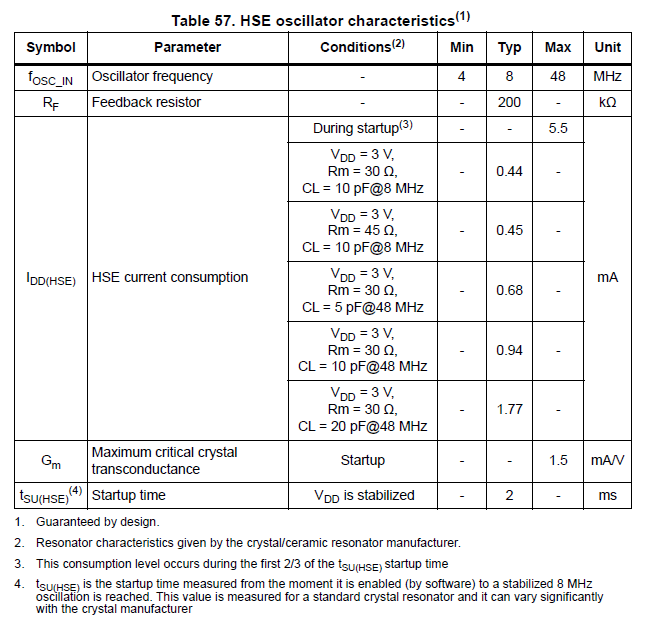
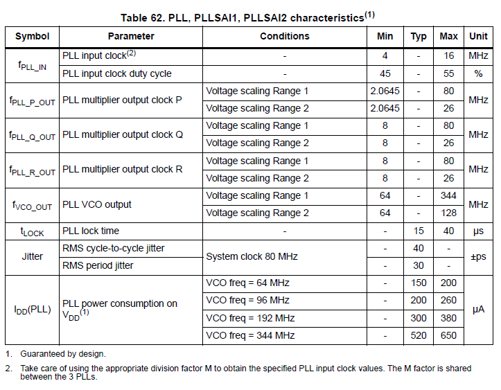

# Understanding the Flowchart Signal Path
The diagram illustrates the signal path and processing flow within a system based on the STM32L476RG microcontroller (MCU).

## PA8: RCC_MCO1 Output
PA8 is a multifunctional GPIO pin on the STM32L476RG (LQFP64 package, pin 41), capable of digital I/O, alternate functions (AF), and analog modes. It's sourced from an external 20 MHz quartz crystal (X3) for improved accuracy and stability—essential for precise permittivity measurements in varying mountain environments Since the quartz can withstand extreme tempreture (-20°C to 80°C).

The PA8 outputs a stable 20 MHz square wave by tapping the RCC_MCO1, derived from SYSCLK (which can go upto 80 MHz) divided by 4. This provides a fixed 50% duty signal for the LC filter.

### Clock Source Selection
#### The high-speed external (HSE) clock
The Software sets SYSCLK to the choosen Frequenzy (HSE/PLL for stability, ±50 ppm with HSE crystal recommended for mountains). 
The high-speed external (HSE) clock can be supplied with a 4 to 48 MHz crystal/ceramic resonator oscillator.

Source: p.149, STM32L476xx Datasheet

### PLL Role
Direct HSE is fixed at 20 MHz; PLL allows flexible SYSCLK (70-80 MHz), then MCO divider tunes output.
The notch filter resonates at ~20 MHz in air; snow shifts it (Δf ∝ ε', ΔQ ∝ 1/ε''). 

To calibrate (find minimum amplitude), the feedback loop (flowchart PROC block) uses binary search:
- Measure notch output amplitude (ADC → FFT → Peak detection).
- If not minimum, adjust PLL multipliers/dividers to change MCO frequency (e.g., from 20 MHz to 17.5 MHz).
- Re-measure until tuned.

HSE (20 MHz) → Selected as PLL input → Multiplied to 80 MHz SYSCLK for fast processing → Divided back to 20 MHz for MCO output.

Source: P.158, STM32L476xx Datasheet

### What Controls What

- HSE controls the filter signal (stable base).
- SYSCLK (from HSE/PLL) controls MCU speed (e.g., 80 MHz for quick FFT on 512 ADC samples).
- LSI/LSE control low-power/timing (not filter-related).
