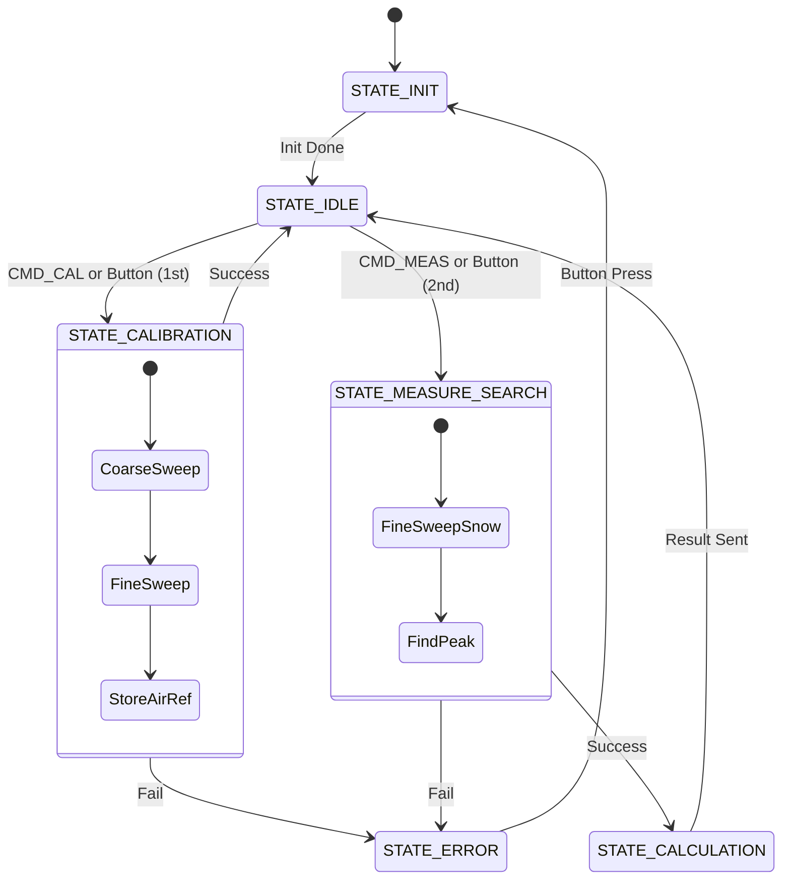
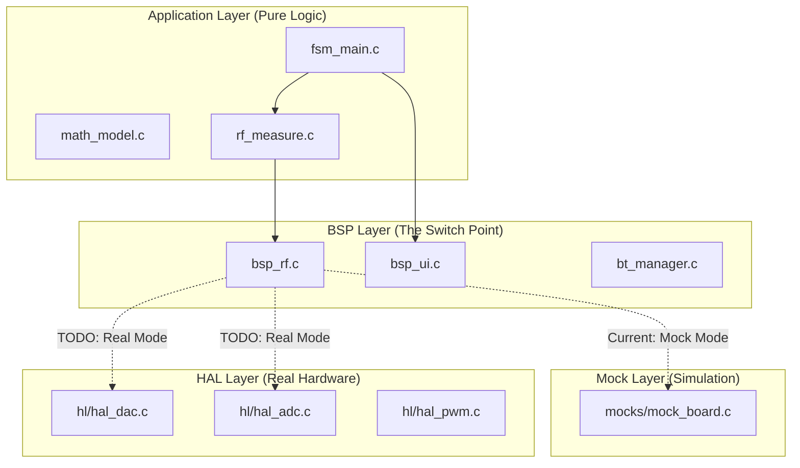

# Permittivity Meter Firmware

**Target Hardware**: STM32L476RG (NUCLEO-L476RG)  
**Version**: 1.2 (Dev)  
**Date**: Dec 2025

This project implements the firmware for a **Permittivity Meter**, a device designed to measure the dielectric properties of materials (specifically snow) using an RF resonance circuit. The system sweeps a frequency range, detects resonance shifts, and calculates permittivity and density.

---

## 1. System Overview

The firmware is architected around a **Finite State Machine (FSM)** that manages the complex lifecycle of calibration, measurement, and calculation. It separates high-level application logic from low-level hardware drivers using a Board Support Package (BSP) layer.

### Application Lifecycle (FSM)

The system moves through the following states to perform a measurement:



1. **STATE_INIT**: Initializes hardware (RF, UI, LCD, BT).
2. **STATE_IDLE**: Waits for user input (Button) or remote commands (Bluetooth/PC).
3. **STATE_CALIBRATION**: Sweeps the RF circuit with "Air" to find the baseline resonance.
4. **STATE_MEASURE_SEARCH**: Sweeps with the material to find the shifted resonance.
5. **STATE_CALCULATION**: Computes $\epsilon'$ and $\epsilon''$ using the frequency shift and Q-factor change.
6. **STATE_ERROR**: Handles hardware faults or timeouts.

---

## 2. Hardware Configuration

### Pinout Configuration

| Pin | Name | Function | Description |
| :--- | :--- | :--- | :--- |
| **PC13** | `B1` | **User Button** | Triggers Calibration (1st press) or Measurement (2nd press). |
| **PA6** | `INIT_LED` | **LED (Green)** | Indicates System Initialization / Idle State. |
| **PA7** | `MEAS_LED` | **LED (Blue)** | Indicates Measurement/Calibration in progress. |
| **PC7** | `EXCITE_LED` | **LED (Yellow)** | Indicates RF Excitation is Active. |
| **PB6** | `ERR_LED` | **LED (Red)** | Indicates Error State. |
| **PA4** | `FRQ_TN` | **DAC1 Ch1** | Frequency Tuning Varicap Voltage. |
| **PA5** | `Q_FACT_TN` | **DAC1 Ch2** | Q-Factor Tuning Varicap Voltage. |
| **PA9** | `SQR_20M_OUT` | **TIM1 CH2** | 20 MHz PWM Excitation Signal. |
| **PA1** | `NINA_RX` | **UART4 RX** | Bluetooth Module RX. |
| **PA0** | `NINA_TX` | **UART4 TX** | Bluetooth Module TX. |
| **PA2** | `VCP_TX` | **USART2 TX** | USB Virtual COM Port TX. |
| **PA3** | `VCP_RX` | **USART2 RX** | USB Virtual COM Port RX. |
| **PC8** | `GAIN_SLCT_1` | **GPIO Out** | RF Gain Select Bit 0. |
| **PC9** | `GAIN_SLCT_2` | **GPIO Out** | RF Gain Select Bit 1. |
| **PB8** | `I2C1_SCL` | **I2C SCL** | LCD Display Clock. |
| **PB9** | `I2C1_SDA` | **I2C SDA** | LCD Display Data. |

### Electronics Notes

* **PWM Output**: The GPIO (PA9) outputs 3.3V, but the RF circuit requires a **1V peak**. An **OpAmp buffer** with attenuation is required between the MCU and the circuit.
* **Varicap Control**: The DAC outputs (PA4, PA5) control the Varicaps. Channel 1 tunes the frequency (D1), and Channel 2 tunes the Q-factor.

---

## 3. Software Architecture

The project follows a layered architecture to ensure testability and separation of concerns.



### File Purpose & Hardware Interaction

| File Path | Purpose | Hardware vs. Mock |
| :--- | :--- | :--- |
| **`Core/Src/fsm_main.c`** | **The Brain**. Controls the high-level state (Idle, Calibrate, Measure). | **Pure Logic**. Does not touch hardware directly. |
| **`Core/Src/rf_measure.c`** | **The Scientist**. Implements the sweep algorithms (Coarse/Fine). | **Logic**. Calls `bsp_rf.c` to set voltages/read values. |
| **`Core/Src/bsp_rf.c`** | **The Bridge**. The Board Support Package (BSP) for the RF frontend. | **Switch Point**. Currently **MOCK**. Needs to call HAL drivers. |
| **`Core/Src/hl/hal_*.c`** | **The Drivers**. Wrappers around STM32 HAL. | **Real Hardware**. Directly manipulates registers. |
| **`Core/Src/bt_manager.c`** | **The Communicator**. Handles ASCII protocol (`CMD:`, `DAT:`). | **Real Hardware**. Mirrors traffic to UART4 (BT) and USART2 (USB). |

### Signal Processing (Undersampling)

The RF signal is **20 MHz**, which exceeds the Nyquist limit of the STM32 ADC (~5 Msps). We use **Undersampling (Bandpass Sampling)**:

1. **Sampling Rate ($f_s$)**: Configured (via TIM6) such that $|20\text{MHz} - N \cdot f_s| \approx 10\text{-}50\text{kHz}$.
2. **Capture**: DMA fills a buffer (e.g., 256 samples).
3. **Processing**: A **DFT/FFT** extracts the magnitude of the alias frequency. This acts as a narrowband filter.

---

## 4. User Interface (UI)

The device operates autonomously using the onboard Button, LEDs, and LCD.

### Button Logic (PC13)

* **1st Press**: Triggers **Calibration** (if no valid calibration exists).
* **2nd Press**: Triggers **Measurement** (if calibration is valid).
* **Press in Error State**: Resets the system to Init.

### LED & LCD Status

| State | LCD Line 1 | LCD Line 2 | LEDs Active | Description |
| :--- | :--- | :--- | :--- | :--- |
| **INIT** | `INIT` | `Booting...` | **Init (Green)** | System startup. |
| **IDLE** | `IDLE` | `Ready` (or `Need CAL`) | **Init (Green)** | Waiting for input. |
| **CALIBRATION** | `CAL` | `Sweeping...` | **Meas (Blue)**, **Excite (Yellow)** | Finding "Air" resonance. |
| **MEASURE** | `MEAS` | `Sampling...` | **Meas (Blue)**, **Excite (Yellow)** | Finding "Snow" resonance. |
| **RESULT** | `RESULT` | `Sending...` | **Meas (Blue)** | Calculation complete. **TODO**: Display calculated value. |
| **ERROR** | `ERROR` | `Check host` | **Error (Red)** | Hardware failure. |

---

## 5. Development Roadmap (To-Dos)

### A. Transition from Mock to Real Hardware (Priority: High)

* **Context**: `bsp_rf.c` is currently a mock that logs to UART but doesn't touch pins.
* **Tasks**:
    1. [ ] **Enable Drivers**: In `bsp_rf.c`, replace `Debug_LogDriver` with:
        * `HL_DAC_SetVoltage(DAC_CH_FREQ, v)`
        * `HL_DAC_SetVoltage(DAC_CH_Q, v)`
    2. [ ] **Clean Main Loop**: Remove the manual waveform generation code in `main.c`'s `while(1)` loop. It conflicts with the FSM.
    3. [ ] **Verify Timing**: Add `HAL_Delay(1)` in `rf_measure.c`'s `sample_at()` to allow Varicap voltage to settle.

### B. Signal Processing Implementation

* **Context**: We need to measure 20MHz using a slower ADC via undersampling.
* **Tasks**:
    1. [ ] **ADC Timer**: Configure `main.c` / `hal_adc.c` (TIM6) to a specific frequency $f_s$ (e.g., ~800.1 kHz) to alias 20MHz to ~2.5kHz.
    2. [ ] **Buffer Capture**: Implement `BSP_RF_CaptureBuffer(float* buffer, size_t len)` in `bsp_rf.c` using DMA.
    3. [ ] **DFT Logic**: Implement a simple DFT/Goertzel in `math_model.c` to calculate magnitude at the alias frequency.
    4. [ ] **Update Measure**: Modify `rf_measure.c` to use the buffer+DFT method instead of single-point sampling.

### C. User Interface Enhancements

* **Context**: The LCD currently only shows status strings, not results.
* **Tasks**:
    1. [ ] **Display Result**: Update `FSM_HandleCalculation` to format the result (e.g., `E: 1.54 D: 0.32`) and display it on the LCD.

### D. PC Control & Mirroring

* **Context**: The PC CLI (`tools/pc_cli.py`) should control the device exactly like the Bluetooth app.
* **Tasks**:
    1. [ ] **Verify Mirroring**: Ensure `bt_manager.c` sends all outputs to both UART4 (BT) and USART2 (USB).
    2. [ ] **USB Input**: Ensure `usci_a_uart.c` forwards USB CDC data to the command parser.

### E. Hardware / Electronics

* [ ] **PWM Level**: Add OpAmp buffer/divider to PA9 to attenuate 3.3V PWM to 1V peak.
* [ ] **Power**: Design for -40°C operation and battery support.

---

## 6. CLI Command Reference

The following ASCII commands are supported via **UART4 (Bluetooth)** and **USART2 (USB)**. All commands must be terminated with `\n` or `\r\n`.

### Control Commands

| Command | Description | Response |
| :--- | :--- | :--- |
| `CMD:CONN` | Establishes connection. | `STAT:RDY` |
| `CMD:CAL` | Triggers Calibration (Air Sweep). | `STAT:CAL` -> `STAT:CAL_OK` or `STAT:ERR` |
| `CMD:MEAS` | Triggers Measurement (Snow Sweep). | `STAT:MEAS` -> `DAT:RES:...` or `STAT:ERR` |
| `CMD:BTN:PRESS` | Simulates Button Press. | `STAT:BTN_PRESS` |
| `CMD:BTN:RELEASE` | Simulates Button Release. | `STAT:BTN_REL` |

### Debug & Status Commands

| Command | Description | Response Format |
| :--- | :--- | :--- |
| `CMD:LEDS` | Request LED status snapshot. | `STAT:LED:S:<0/1>:M:<0/1>:E:<0/1>:R:<0/1>` |
| `CMD:LCD` | Request LCD content snapshot. | `DAT:LCD:L0:<text>` then `DAT:LCD:L1:<text>` |
| `CMD:LOG` | Dump internal debug log buffer. | `DAT:LOG:D:<domain>:S:<state>:<msg>` |
| `CMD:TRACE` | Dump last RF sweep data. | `DAT:TRACE:<mode>:<idx>:V:<volt>:A:<amp>` |

### Mock Control Commands (Simulation Only)

These commands configure the internal mock engine when hardware is not available.

| Command | Description |
| :--- | :--- |
| `CMD:MOCK:RF:RES:<float>` | Set the resonance voltage (location of the minimum). Default: `1.2`. |
| `CMD:MOCK:RF:NOISE:<float>` | Set the random noise level added to the signal. Default: `0.01`. |
| `CMD:MOCK:RF:BASE:<float>` | Set the base amplitude (vertical offset). Default: `1.0`. |
| `CMD:MOCK:RF:FAIL:<ON/OFF>` | Force the RF mock to return `NAN` (simulating sensor failure). |

### HAL Board Commands (Manual/Debug Hardware Control)

These commands provide direct hardware control for manual testing and debugging. They bypass the FSM and directly manipulate hardware via HAL drivers.

#### LED Control

| Command | Description | Response |
| :--- | :--- | :--- |
| `CMD:HAL:LED:SET:<id>:<state>` | Set LED state (0=OFF, 1=ON) | `STAT:HAL_LED_<id>_ON/OFF` |
| `CMD:HAL:LED:GET:<id>` | Read LED state | `STAT:HAL_LED_<id>:<0/1>` |
| `CMD:HAL:LED:TOGGLE:<id>` | Toggle LED state | `STAT:HAL_LED_<id>_TOG` |

*LED IDs: 0=INIT (Green), 1=MEAS (Blue), 2=EXCITE (Yellow), 3=ERR (Red)*

#### Button

| Command | Description | Response |
| :--- | :--- | :--- |
| `CMD:HAL:BTN:READ` | Read physical button state | `STAT:HAL_BTN:PRESSED` or `STAT:HAL_BTN:RELEASED` |

#### ADC

| Command | Description | Response |
| :--- | :--- | :--- |
| `CMD:HAL:ADC:READ` | Read ADC as voltage | `STAT:HAL_ADC:1.650V` |
| `CMD:HAL:ADC:RAW` | Read raw 12-bit ADC value | `STAT:HAL_ADC:2048` |

#### DAC

| Command | Description | Response |
| :--- | :--- | :--- |
| `CMD:HAL:DAC:SET:<ch>:<voltage>` | Set DAC channel voltage (0.0-3.3V) | `STAT:HAL_DAC_<ch>:<voltage>V` |
| `CMD:HAL:DAC:RAW:<ch>:<value>` | Set DAC raw 12-bit value (0-4095) | `STAT:HAL_DAC_<ch>:<value>` |

*DAC Channels: 0=FREQ_TUNE (PA4), 1=Q_FACTOR (PA5)*

#### RF Gain

| Command | Description | Response |
| :--- | :--- | :--- |
| `CMD:HAL:GAIN:SET:<level>` | Set RF gain level (0-3) | `STAT:HAL_GAIN:<level>` |
| `CMD:HAL:GAIN:GET` | Read current RF gain level | `STAT:HAL_GAIN:<level>` |

#### NINA Bluetooth Module

| Command | Description | Response |
| :--- | :--- | :--- |
| `CMD:HAL:NINA:RST:<state>` | Set reset pin (0=reset, 1=run) | `STAT:HAL_NINA:RESET` or `STAT:HAL_NINA:RUN` |
| `CMD:HAL:NINA:STOP:<state>` | Set stop pin (0=run, 1=stop) | `STAT:HAL_NINA:RUNNING` or `STAT:HAL_NINA:STOPPED` |

#### Initialization

| Command | Description | Response |
| :--- | :--- | :--- |
| `CMD:HAL:INIT` | Initialize HAL Board module | `STAT:HAL_INIT_OK` |

### HAL Board Architecture

The HAL Board module (`hal_board.c`) provides a **direct hardware control interface** that bypasses the FSM. This is useful for manual testing and debugging.

#### Command Flow

```text
Terminal/PC (UART)                                    STM32
      │                                                 │
      │  "CMD:HAL:LED:SET:0:1\n"                        │
      └─────────────────────────────────────────────────►
                          │
                          ▼
                ┌─────────────────────┐
                │  BT_ProcessIncoming │  (bt_manager.c)
                │  checks "CMD:HAL"   │
                └─────────┬───────────┘
                          ▼
                ┌─────────────────────┐
                │  handle_hal_command │  routes to sub-handler
                └─────────┬───────────┘
                          ▼
                ┌─────────────────────────┐
                │  handle_hal_led_command │  parses id=0, state=1
                └─────────┬───────────────┘
                          ▼
                ┌─────────────────────┐
                │  HalBoard_LED_Set() │  (hal_board.c)
                └─────────┬───────────┘
                          ▼
                ┌─────────────────────┐
                │  HL_GPIO_WritePin() │  (hal_gpio.c)
                └─────────┬───────────┘
                          ▼
                      [LED ON!]
```

#### Layer Purpose

| Layer | File | Purpose |
| :--- | :--- | :--- |
| **CLI Parser** | `bt_manager.c` | Parses ASCII commands, routes to handlers |
| **HAL Board** | `hal_board.c` | Wrapper functions for hardware access |
| **HAL Drivers** | `hal_gpio.c`, `hal_dac.c`, etc. | Direct STM32 register manipulation |

#### Usage Example

```bash
# Set LED 0 (Green) ON
CMD:HAL:LED:SET:0:1
→ STAT:HAL_LED_0_ON

# Read ADC voltage
CMD:HAL:ADC:READ
→ STAT:HAL_ADC:1.650V

# Set DAC channel 0 to 1.5V
CMD:HAL:DAC:SET:0:1.5
→ STAT:HAL_DAC_0:1.50V
```

## 7. Mock Simulation Details

When running without real hardware (or when `bsp_rf.c` is in mock mode), the system simulates the RF response mathematically.

### RF Response Model

The mock generates a **parabolic dip (minimum)** to simulate the resonance circuit absorption.

* **Formula**: $Amplitude = Base + Curvature \cdot (V_{dac} - V_{res})^2 + Noise$
* **Behavior**: The firmware's peak detection algorithm looks for a **minimum** amplitude.
* **Default**: A minimum at **1.2V** with a base amplitude of **1.0V**.

### Verification

* **Correctness**: The mock correctly produces a "U" shape, and the `rf_measure.c` logic correctly searches for a minimum (`if (amp < local_best_amp)`).
* **Limitations**: The mock does not currently simulate the Q-factor change significantly (it only adds a small linear offset based on Q-voltage).

### Missing CLI Features (TODO)

* **RF State Readback**: There is currently no command (e.g., `CMD:RF:STAT`) to read the instantaneous state of the RF hardware (Excitation On/Off, Current DAC Voltage). This must be inferred from `CMD:TRACE` or `CMD:LEDS` (Excite LED).
* ~~**Direct Hardware Control**: There are no commands to manually set DAC voltages or toggle pins for low-level testing.~~ **DONE**: `CMD:HAL:*` commands now provide direct hardware control (see Section 6: HAL Board Commands).

### latest Todos

Umbauen auf real mode (siehe 3. Software architecture)
und dann testen mit frequenzgenerator, im prinzip alles

Handyapp und bluetooth funktion wird nicht implementiert, es wird nur das UART protokoll für die Messdaten implementiert, wenn die nächste gruppe dann weiter macht brauchen die nurnoch die app draufsetzen.

Die Commandhandler für input/output sollen noch implementiert werden (Buttons ADC LED usw.) hal gpio und die todos

Roman:
Plakat machen
OPV oder Pegelwandler dimensionieren 1V für benni
Buck converter für 1v pegelwandler (vllt) Dimensionieren
Boost converter für 33v umdimensionieren
Dimensionierungen für meine Bauteile dokumentieren (Matlab)
