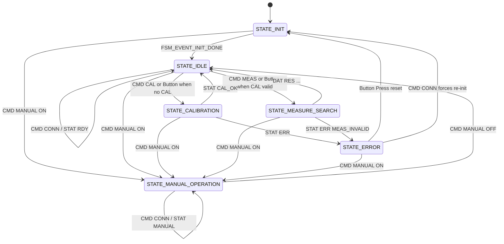
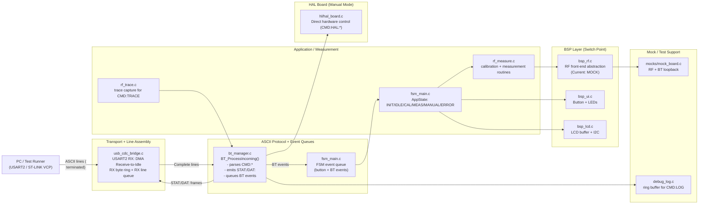

# Permittivity Meter Firmware

**Target Hardware**: STM32L476RG (NUCLEO-L476RG)  
**Version**: 1.2 (Dev)  
**Date**: Dec 2025

This project implements the firmware for a **Permittivity Meter**, a device designed to measure the dielectric properties of materials (specifically snow) using an RF resonance circuit. The system sweeps a frequency range, detects resonance shifts, and calculates permittivity and density.

---

## 1. System Overview

The firmware is architected around a **Finite State Machine (FSM)** that manages the complex lifecycle of calibration, measurement, and calculation. It separates high-level application logic from low-level hardware drivers using a Board Support Package (BSP) layer.

### Application Lifecycle (FSM)

The system moves through the following states to perform a measurement:



1. **STATE_INIT**: Initializes modules (RF mock/BSP, UI, LCD, command protocol).
2. **STATE_IDLE**: Waits for input (button) or `CMD:*` frames. `CMD:CONN` responds with `STAT:RDY` in this state.
3. **STATE_CALIBRATION**: Runs `RF_PerformAirCalibration()` and returns `STAT:CAL_OK` or `STAT:ERR`.
4. **STATE_MEASURE_SEARCH**: Runs `RF_PerformSnowMeasurement()` and returns `DAT:RES:...` or `STAT:ERR:MEAS_INVALID`.
5. **STATE_MANUAL_OPERATION**: Safety/manual override. RF outputs are forced OFF. `CMD:HAL:*` is only accepted here.
6. **STATE_ERROR**: Indicates a failure; button press (or `CMD:CONN`) re-initializes.

Note: `CMD:CONN` is state-dependent: it returns `STAT:RDY` (IDLE/ERROR), `STAT:CAL` (CALIBRATION), `STAT:MEAS` (MEASURE_SEARCH), or `STAT:MANUAL` (MANUAL_OPERATION).

Note: `STATE_CALCULATION` exists in the enum for future expansion, but the current V2 flow sends the result directly from the measurement state.

---

## Bring-up Notes (Dec 2025)

On some custom boards the external HSE (e.g., a bare 20 MHz crystal) may fail to start. Historically this caused the firmware to hang inside `SystemClock_Config()`.

The firmware now:

- Falls back to MSI so the device stays controllable.
- Uses DMA Receive-to-Idle on USART2 when RX DMA is configured (recommended). If clock-fallback is active and no RX DMA is available, it falls back to polling RX.

Expected boot output (order) on USART2 (ST-LINK VCP):

```text
STAT:UART_RX:DMA_IDLE   (preferred)
# or: STAT:UART_RX:IT_IDLE
# or: STAT:UART_RX:POLL (only if clock-fallback is active and no RX DMA)
STAT:RESET_CAUSE:<...>
STAT:BOOT_V2
```

After that, `CMD:CONN` should respond with exactly one `STAT:RDY`.

---

## 2. Hardware Configuration

### Pinout Configuration

> [!NOTE]
> This is a summary. For the authoritative pinout, see [Dokumentation/Pinout_config/README.md](Dokumentation/Pinout_config/README.md).

| Pin | Name | Function | Description |
| :--- | :--- | :--- | :--- |
| **PA0** | `SQR_20M_OUT` | **PWM Output** | 20 MHz Excitation Signal (TIM2_CH1). |
| **PA4** | `FRQ_TN` | **DAC1 Ch1** | Frequency Tuning Varicap Voltage. |
| **PA5** | `Q_FACT_TN` | **DAC1 Ch2** | Q-Factor Tuning Varicap Voltage. |
| **PC0** | `NOTCH_AMP_IN` | **ADC1 IN1** | Notch Filter Output Amplitude. |
| **PC13** | `B1` | **User Button** | Wake-up / Manual Trigger. |
| **PB8** | `INIT_LED` | **LED (Green)** | System Initialization / Status. |
| **PC9** | `MEAS_LED` | **LED (Yellow)** | Measurement in Progress. |
| **PC8** | `EXCITE_LED` | **LED (Blue)** | RF Excitation Active. |
| **PC6** | `ERR_LED` | **LED (Red)** | Error State. |
| **PC10** | `NINA_TX` | **UART4 TX** | Bluetooth Module TX. |
| **PC11** | `NINA_RX` | **UART4 RX** | Bluetooth Module RX. |
| **PA15** | `NINA_RTS` | **UART4 RTS** | Bluetooth Flow Control (RTS). |
| **PA11** | `NINA_RST` | **GPIO Output** | NINA Reset (Active Low). |
| **PC3** | `GAIN_SLCT_1` | **GPIO Output** | RF Gain Select Bit 0. |
| **PC1** | `GAIN_SLCT_2` | **GPIO Output** | RF Gain Select Bit 1. |
| **PB0** | `GAIN_SLCT_3` | **GPIO Output** | RF Gain Select Bit 1. |
| **PC4** | `OP_DIS` | **GPIO Output** | Op-Amp Disable. |
| **PA9** | `SQR_20M_OUT` | **TIM1 CH2** | 20 MHz PWM Excitation Signal. |
| **PA2** | `VCP_TX` | **USART2 TX** | USB Virtual COM Port TX. |
| **PA3** | `VCP_RX` | **USART2 RX** | USB Virtual COM Port RX. |
| **PB6** | `LCD_SCL` | **I2C SCL** | LCD Display Clock. |
| **PB7** | `LCD_SDA` | **I2C SDA** | LCD Display Data. |

### Electronics Notes

- **PWM Output**: The GPIO (PA0) outputs 3.3V, but the RF circuit requires a **1V peak**. An **OpAmp buffer** with attenuation or a voltage divider is required between the MCU and the circuit.
- **Varicap Control**: The DAC outputs (PA4, PA5) control the Varicaps. Channel 1 tunes the frequency (D1), and Channel 2 tunes the Q-factor.

---

## Signal Path

The diagram illustrates the signal path and processing flow within the system.


### PA8: RCC_MCO1 Output

PA8 is a multifunctional GPIO pin on the STM32L476RG (LQFP64 package, pin 41), capable of digital I/O, alternate functions (AF), and analog modes. It's sourced from an external 20 MHz quartz crystal (X3) for improved accuracy and stability—essential for precise permittivity measurements in varying mountain environments since the quartz can withstand extreme temperature (-20°C to 80°C).

The PA8 outputs a stable 20 MHz square wave by tapping the RCC_MCO1, derived from SYSCLK (which can go up to 80 MHz) divided by 4. This provides a fixed 50% duty signal for the LC filter.

### Clock Source Selection

The high-speed external (HSE) clock can be supplied with a 4 to 48 MHz crystal/ceramic resonator oscillator. The software sets SYSCLK to the chosen frequency (HSE/PLL for stability, ±50 ppm with HSE crystal recommended for mountains).

### PLL Role

Direct HSE is fixed at 20 MHz; PLL allows flexible SYSCLK (70-80 MHz), then MCO divider tunes output. The notch filter resonates at ~20 MHz in air; snow shifts it (Δf ∝ ε', ΔQ ∝ 1/ε'').

To calibrate (find minimum amplitude), the feedback loop uses binary search:

1. Measure notch output amplitude (ADC → FFT → Peak detection).
2. If not minimum, adjust PLL multipliers/dividers to change MCO frequency (e.g., from 20 MHz to 17.5 MHz).
3. Re-measure until tuned.

**Clock Flow**: HSE (20 MHz) → Selected as PLL input → Multiplied to 80 MHz SYSCLK for fast processing → Divided back to 20 MHz for MCO output.

---

## 3. Software Architecture

The project follows a layered architecture to ensure testability and separation of concerns.



### File Purpose & Hardware Interaction

| File Path | Purpose | Hardware vs. Mock |
| :--- | :--- | :--- |
| **`Core/Src/fsm_main.c`** | **The Brain**. Controls the high-level state (Idle, Calibrate, Measure). | **Pure Logic**. Does not touch hardware directly. |
| **`Core/Src/rf_measure.c`** | **The Scientist**. Implements the sweep algorithms (Coarse/Fine). | **Logic**. Calls `bsp_rf.c` to set voltages/read values. |
| **`Core/Src/bsp_rf.c`** | **The Bridge**. The Board Support Package (BSP) for the RF frontend. | **Switch Point**. Currently **MOCK**. Needs to call HAL drivers. |
| **`Core/Src/hl/hal_*.c`** | **The Drivers**. Wrappers around STM32 HAL. | **Real Hardware**. Directly manipulates registers. |
| **`Core/Src/bt_manager.c`** | **The Communicator**. Handles ASCII protocol (`CMD:`, `DAT:`). | **Real Hardware**. Mirrors traffic to UART4 (BT) and USART2 (USB). |

### Signal Processing (Undersampling)

The RF signal is **20 MHz**, which exceeds the Nyquist limit of the STM32 ADC (~5 Msps). We use **Undersampling (Bandpass Sampling)** to alias the signal down to a measurable frequency.

**Configuration (Verified 21-Dec-2025):**

1. **Sampling Rate ($f_s$)**: **122.5 kHz** (via TIM6 Trigger).
   - Clock: 80 MHz / 653 $\approx$ 122.511 kHz.
   - Measured Interrupt Rate (PC9 Toggle): ~59.81 Hz $\rightarrow$ ~120.44 kHz effective sampling (consistent with 1024-sample DMA buffer).
2. **Alias Target**: With 20 MHz input and 122.511 kHz sampling, the alias appears at **~30.4 kHz**.
3. **Capture**: DMA fills a generic buffer (Ping-Pong, total 1024 samples).
4. **Processing**: A **DFT/Goertzel** algorithm extracts the magnitude of this ~30 kHz alias.

---

## 4. User Interface (UI)

The device operates autonomously using the onboard Button, LEDs, and LCD.

### Button Logic (PC13)

- **1st Press**: Triggers **Calibration** (if no valid calibration exists).
- **2nd Press**: Triggers **Measurement** (if calibration is valid).
- **Press in Error State**: Resets the system to Init.

### LED & LCD Status

| State | LCD Line 1 | LCD Line 2 | LEDs Active | Description |
| :--- | :--- | :--- | :--- | :--- |
| **INIT** | `INIT` | `Booting...` | **Init (Green)** | System startup. |
| **IDLE** | `IDLE` | `Ready` (or `Need CAL`) | **Init (Green)** | Waiting for input. |
| **CALIBRATION** | `CAL` | `Sweeping...` | **Meas (Blue)**, **Excite (Yellow)** | Finding "Air" resonance. |
| **MEASURE** | `MEAS` | `Sampling...` | **Meas (Blue)**, **Excite (Yellow)** | Finding "Snow" resonance. |
| **ERROR** | `ERROR` | `Check host` | **Error (Red)** | Hardware failure. |

Note: there is no separate FSM state called "RESULT" in the current V2 flow. The result is emitted as `DAT:RES:...` and the FSM returns to **IDLE**.

---

## 5. Development Roadmap

> [!NOTE]
> Tasks are ordered by dependency – complete each step before moving to the next.

### Phase 1: Hardware Prerequisites

> These hardware tasks MUST be completed before firmware can be tested on real hardware.

- [x] **1.1 PWM Output Attenuation**
  - Add voltage divider after PA0 to attenuate 3.3V PWM to **1V peak**.
  - The GPIO cannot drive 50Ω directly; an OpAmp buffer is required.

- [x] **1.2 Varicap Wiring Verification**
  - Confirm PA4 (DAC Ch1) connects to D1 (Frequency Tuning).
  - Confirm PA5 (DAC Ch2) connects to D2 (Q-Factor Tuning).

---

### Phase 2: Mock-to-Hardware Transition  *(Priority: High)*

> These firmware tasks transition from simulation to real hardware control.

- [ ] **2.1 Enable HAL Drivers in BSP**
  - In `bsp_rf.c`, replace `Debug_LogDriver()` calls with:
    - `HL_DAC_SetVoltage(DAC_CH_FREQ, v)` for frequency tuning.
    - `HL_DAC_SetVoltage(DAC_CH_Q, v)` for Q-factor tuning.
  - Verify PWM is started via `HL_PWM_Start()`.

- [x] **2.2 Clean Up `main.c`**
  - Remove the manual waveform generation code in the `while(1)` loop.
  - Let the FSM control all hardware via BSP functions.

- [ ] **2.3 Add Settling Delay**
  - In `rf_measure.c`, add `HAL_Delay(1)` in `sample_at()` to allow Varicap voltage to settle before ADC read.

- [ ] **2.4 Integration Test**
  - Run Calibration via button press.
  - Verify DAC voltages change on PA4/PA5 (use multimeter or scope).
  - Verify 20 MHz PWM is active on PA9 during sweep.

---

### Phase 3: Signal Processing (Undersampling)

> Implement the ADC capture and DFT processing to measure 20 MHz.

- [x] **3.1 Configure ADC Sampling Timer (TIM6)**
  - Set TIM6 to trigger ADC at ~122.5 kHz.
  - This aliases 20 MHz down to ~30.4 kHz (within measurable range).

- [ ] **3.2 Implement DMA Buffer Capture**
  - In `bsp_rf.c`, implement `BSP_RF_CaptureBuffer(float* buffer, size_t len)`.
  - Use DMA to fill a buffer (e.g., 256 samples) from ADC.

- [ ] **3.3 Implement DFT/Goertzel Algorithm**
  - In `math_model.c`, implement Goertzel algorithm for single-frequency magnitude extraction.
  - Target the alias frequency (~2.5 kHz).

- [ ] **3.4 Update Measurement Logic**
  - Modify `rf_measure.c` to use buffer+DFT method instead of single-point sampling.
  - Return magnitude at each DAC voltage step.

- [ ] **3.5 Signal Processing Test**
  - Inject known signal and verify magnitude extraction.
  - Plot sweep curve (Voltage vs. Magnitude) to verify resonance dip detection.

---

### Phase 4: Calibration & Measurement Algorithms

> Implement the scientific measurement routines.

- [ ] **4.1 Calibration Routine (Air Reference)**
  - Coarse sweep: Sweep D1 (PA4) to find rough minimum (resonance frequency in air).
  - Fine sweep: Adjust D2 (PA5) to optimize the minimum.
  - Store reference voltage `V_Ref` and Q-factor baseline.

- [ ] **4.2 Measurement Routine (Snow/Sample)**
  - Fine sweep: Tune D1 to bring minimum back to 20 MHz in sample.
  - Store measurement voltage `V_M` and Q-factor.

- [ ] **4.3 Permittivity Calculation**
  - Implement Denoth's formula: `ε' = 1 + k_D × log(V_M / V_Ref)`.
  - Constant `k_D = 0.5963` (from BB353 varactor).
  - Implement imaginary part: `ε'' = 1 / (ω × Rp × C0)`.

---

### Phase 5: User Interface & Communication

> Display results and ensure robust communication.

- [x] **5.1 Display Result on LCD**
  - Update `FSM_HandleCalculation()` to format result (e.g., `E: 1.54 D: 0.32`).
  - Display permittivity and density on LCD Line 2.

- [x] **5.2 Verify UART Mirroring**
  - Confirm `bt_manager.c` sends all outputs to both UART4 (BT) and USART2 (USB).
  - Test with PC CLI (`tools/pc_cli.py`).

- [x] **5.3 USB Input Handling**
  - DONE in V2: USART2 RX is line-wise (Receive-to-Idle, DMA preferred) and feeds `BT_ProcessIncoming()` via `usb_cdc_bridge.c`.

---

### Phase 6: Power & Environmental Design

> Prepare for field deployment.

- [ ] **6.1 Low-Temperature Design**
  - Select components rated for -40°C to +85°C.
  - Test hardware operation at low temperature.

- [ ] **6.2 Battery Support**
  - Design battery/powerbank input circuitry.
  - Select regulator (Buck/Boost) and calculate runtime.

- [ ] **6.3 Shield Pinout Definition**
  - Define "Permittivity Shield v1.0" using outer peripheral pins of Nucleo.
  - Document final pinout and connector placement.

---

### Completed Tasks

- [x] **Driver Verification** (01-Dec-2025)
  - ADC driver (122.5 kHz sampling) – Verified.
  - PWM driver (20 MHz output) – Verified.
  - DAC driver (dual channel) – Verified.

- [x] **External Crystal Selection** (07-Nov-2025)
  - Part: 449-LFXTAL058284BULK (X3 on BOM).
  - [Mouser Link](https://www.mouser.at/ProductDetail/IQD/LFXTAL058284Bulk?qs=sGAEpiMZZMsBj6bBr9Q9af1kE%252BXo19x3mGiGn1Dh61%2FyhX7eZvTWqw%3D%3D)

## 6. CLI Command Reference

The following ASCII commands are supported on **USART2 (USB VCP)**. The same protocol is intended for **UART4/NINA (Bluetooth)**, but the UART4 transport is not wired up yet.

All commands must be terminated with `\n` or `\r\n`.

### Control Commands

| Command | Description | Response |
| :--- | :--- | :--- |
| `CMD:CONN` | Establishes connection / handshake. | State-dependent: `STAT:RDY` (IDLE/ERROR), `STAT:CAL` (CALIBRATION), `STAT:MEAS` (MEASURE_SEARCH), `STAT:MANUAL` (MANUAL_OPERATION) |
| `CMD:RESET` | Reboot MCU (useful for tests). | `STAT:RESETTING` then reset |
| `CMD:CAL` | Trigger Calibration (Air Sweep). | `STAT:CAL_REQ` → `STAT:CAL` → `STAT:CAL_OK` or `STAT:ERR` |
| `CMD:MEAS` | Trigger Measurement (Snow Sweep). | `STAT:MEAS_REQ` → `STAT:MEAS` → `DAT:RES:...` or `STAT:ERR:MEAS_INVALID` (if measurement invalid). If no valid calibration exists, the request is rejected with `STAT:ERR`. |
| `CMD:BTN:PRESS` | Simulates Button Press. | `STAT:BTN_PRESS` |
| `CMD:BTN:RELEASE` | Simulates Button Release. | `STAT:BTN_REL` |

### Debug & Status Commands

| Command | Description | Response Format |
| :--- | :--- | :--- |
| `CMD:LEDS` | Request LED status snapshot. | `STAT:LED:S:<0/1>:M:<0/1>:E:<0/1>:R:<0/1>` |
| `CMD:LCD` | Request LCD content snapshot. | `DAT:LCD:L0:<text>` then `DAT:LCD:L1:<text>` |
| `CMD:LOG` | Dump internal debug log buffer. | `DAT:LOG:D:<domain>:S:<state>:<msg>` |
| `CMD:TRACE` | Dump last RF sweep data. | `DAT:TRACE:<mode>:<idx>:V:<volt>:A:<amp>` |

### Mock Control Commands (Simulation Only)

These commands configure the internal mock engine when hardware is not available.

| Command | Description |
| :--- | :--- |
| `CMD:MOCK:RF:RES:<float>` | Set the resonance voltage (location of the minimum). Default: `1.2`. |
| `CMD:MOCK:RF:NOISE:<float>` | Set the random noise level added to the signal. Default: `0.01`. |
| `CMD:MOCK:RF:BASE:<float>` | Set the base amplitude (vertical offset). Default: `1.0`. |
| `CMD:MOCK:RF:FAIL:<ON/OFF>` | Force the RF mock to return `NAN` (simulating sensor failure). |

### HAL Board Commands (Manual/Debug Hardware Control)

These commands provide direct hardware control for manual testing and debugging.

To reduce the risk of accidentally toggling real hardware during normal measurement flows, `CMD:HAL:*` is **locked by default** and only accepted while the firmware is in **Manual Mode**.

#### Manual Mode (Handbetrieb)

| Command | Description | Response |
| :--- | :--- | :--- |
| `CMD:MANUAL:ON` | Enter `STATE_MANUAL_OPERATION` (disables excitation/op-amp, enables HAL commands). | `STAT:MANUAL_ON_REQ`, then `STAT:MANUAL_ON` |
| `CMD:MANUAL:OFF` | Leave manual mode and return to idle. | `STAT:MANUAL_OFF_REQ`, then `STAT:MANUAL_OFF` |

While manual mode is active, `CMD:CAL` / `CMD:MEAS` are rejected with `STAT:MANUAL_ACTIVE`.

If you send a `CMD:HAL:*` command while manual mode is not active, the device responds with `STAT:HAL_LOCKED`.

If you send `CMD:MANUAL:OFF` while manual mode is not active, the device responds with `STAT:MANUAL_NOT_ACTIVE`.

#### Push-Style ACK Frames (for UI updates)

In addition to the legacy `STAT:HAL_*` responses, successful `CMD:HAL:*` operations also emit structured frames that include the applied values:

- `STAT:HW:LED:<id>:<0/1>`
- `STAT:HW:DAC:<ch>:V:<volts>` and `STAT:HW:DAC:<ch>:RAW:<value>`
- `STAT:HW:ADC:V:<volts>` and `STAT:HW:ADC:RAW:<value>`
- `STAT:HW:GAIN:<0..3>`
- `STAT:HW:BTN:<0/1>`
- `STAT:HW:NINA:RST:<0/1>` and `STAT:HW:NINA:STOP:<0/1>`
- PWM: `STAT:HW:PWM:RUN:<0/1>`, `STAT:HW:PWM:FREQ:<hz>`, `STAT:HW:PWM:DUTY:<0..100>`

This is intended so the PC GUI can update immediately from responses (without periodic polling).

#### LED Control

| Command | Description | Response |
| :--- | :--- | :--- |
| `CMD:HAL:LED:SET:<id>:<state>` | Set LED state (0=OFF, 1=ON) | `STAT:HAL_LED_<id>_ON/OFF` |
| `CMD:HAL:LED:GET:<id>` | Read LED state | `STAT:HAL_LED_<id>:<0/1>` |
| `CMD:HAL:LED:TOGGLE:<id>` | Toggle LED state | `STAT:HAL_LED_<id>_TOG` |

*LED IDs: 0=INIT (Green), 1=MEAS (Blue), 2=EXCITE (Yellow), 3=ERR (Red)*

#### Button

| Command | Description | Response |
| :--- | :--- | :--- |
| `CMD:HAL:BTN:READ` | Read physical button state | `STAT:HAL_BTN:PRESSED` or `STAT:HAL_BTN:RELEASED` |

#### ADC

| Command | Description | Response |
| :--- | :--- | :--- |
| `CMD:HAL:ADC:READ` | Read ADC as voltage | `STAT:HAL_ADC:1.650V` |
| `CMD:HAL:ADC:RAW` | Read raw 12-bit ADC value | `STAT:HAL_ADC:2048` |

#### DAC

| Command | Description | Response |
| :--- | :--- | :--- |
| `CMD:HAL:DAC:SET:<ch>:<voltage>` | Set DAC channel voltage (0.0-3.3V) | `STAT:HAL_DAC_<ch>:<voltage>V` |
| `CMD:HAL:DAC:RAW:<ch>:<value>` | Set DAC raw 12-bit value (0-4095) | `STAT:HAL_DAC_<ch>:<value>` |

*DAC Channels: 0=FREQ_TUNE (PA4), 1=Q_FACTOR (PA5)*

#### LCD (Simulated)

| Command | Description | Response |
| :--- | :--- | :--- |
| `CMD:HAL:LCD:SET:<line>:<text>` | Overwrite LCD line buffer (0/1) with text (padded/truncated). | `STAT:HAL_LCD_L<line>_OK` |

In addition, the firmware pushes the updated buffer as `DAT:LCD:L<line>:<text>`.

#### PWM / Excitation (TIM1 CH2 / PA9)

| Command | Description | Response |
| :--- | :--- | :--- |
| `CMD:HAL:PWM:START` | Start PWM output. | `STAT:HAL_PWM_START_OK` + `STAT:HW:PWM:*` |
| `CMD:HAL:PWM:STOP` | Stop PWM output. | `STAT:HAL_PWM_STOP_OK` + `STAT:HW:PWM:*` |
| `CMD:HAL:PWM:GET` | Read PWM run/freq/duty. | `STAT:HAL_PWM_OK` + `STAT:HW:PWM:*` |
| `CMD:HAL:PWM:FREQ:<hz>` | Set PWM frequency. | `STAT:HAL_PWM_FREQ_OK` + `STAT:HW:PWM:FREQ:<hz>` |
| `CMD:HAL:PWM:DUTY:<0..100>` | Set PWM duty cycle. | `STAT:HAL_PWM_DUTY_OK` + `STAT:HW:PWM:DUTY:<pct>` |

#### RF Gain

| Command | Description | Response |
| :--- | :--- | :--- |
| `CMD:HAL:GAIN:SET:<level>` | Set RF gain level (0-3) | `STAT:HAL_GAIN:<level>` |
| `CMD:HAL:GAIN:GET` | Read current RF gain level | `STAT:HAL_GAIN:<level>` |

#### NINA Bluetooth Module

| Command | Description | Response |
| :--- | :--- | :--- |
| `CMD:HAL:NINA:RST:<state>` | Set reset pin (0=reset, 1=run) | `STAT:HAL_NINA:RESET` or `STAT:HAL_NINA:RUN` |
| `CMD:HAL:NINA:STOP:<state>` | Set stop pin (0=run, 1=stop) | `STAT:HAL_NINA:RUNNING` or `STAT:HAL_NINA:STOPPED` |
| `CMD:HAL:NINA:DTR:<state>` | Set DTR pin (0=low, 1=high) | `STAT:HAL_NINA_DTR_OK` + `STAT:HW:NINA:DTR:<state>` |
| `CMD:HAL:NINA:DSR:READ` | Read DSR pin state | `STAT:HAL_NINA_DSR_OK` + `STAT:HW:NINA:DSR:<state>` |
| `CMD:HAL:NINA:LED:<id>:READ` | Read NINA LED (0=R, 1=B, 2=G) | `STAT:HAL_NINA_LED_OK` + `STAT:HW:NINA:LED:<id>:<state>` |

#### Op-Amp Control

| Command | Description | Response |
| :--- | :--- | :--- |
| `CMD:HAL:OPAMP:DIS:<state>` | Set Op-Amp Disable (0=en, 1=dis) | `STAT:HAL_OPAMP_OK` + `STAT:HW:OPAMP:DIS:<state>` |

#### Initialization

| Command | Description | Response |
| :--- | :--- | :--- |
| `CMD:HAL:INIT` | Initialize HAL Board module | `STAT:HAL_INIT_OK` |

### HAL Board Architecture

The HAL Board module (`hal_board.c`) provides a **direct hardware control interface** that bypasses the FSM. This is useful for manual testing and debugging.

#### Command Flow

```text
Terminal/PC (UART)                                    STM32
      │                                                 │
      │  "CMD:HAL:LED:SET:0:1\n"                        │
      └─────────────────────────────────────────────────►
                          │
                          ▼
                ┌─────────────────────┐
                │  BT_ProcessIncoming │  (bt_manager.c)
                │  checks "CMD:HAL"   │
                └─────────┬───────────┘
                          ▼
                ┌─────────────────────┐
                │  handle_hal_command │  routes to sub-handler
                └─────────┬───────────┘
                          ▼
                ┌─────────────────────────┐
                │  handle_hal_led_command │  parses id=0, state=1
                └─────────┬───────────────┘
                          ▼
                ┌─────────────────────┐
                │  HalBoard_LED_Set() │  (hal_board.c)
                └─────────┬───────────┘
                          ▼
                ┌─────────────────────┐
                │  HL_GPIO_WritePin() │  (hal_gpio.c)
                └─────────┬───────────┘
                          ▼
                      [LED ON!]
```

#### Layer Purpose

| Layer | File | Purpose |
| :--- | :--- | :--- |
| **CLI Parser** | `bt_manager.c` | Parses ASCII commands, routes to handlers |
| **HAL Board** | `hal_board.c` | Wrapper functions for hardware access |
| **HAL Drivers** | `hal_gpio.c`, `hal_dac.c`, etc. | Direct STM32 register manipulation |

#### Usage Example

```bash
# Set LED 0 (Green) ON
CMD:HAL:LED:SET:0:1
→ STAT:HAL_LED_0_ON

# Read ADC voltage
CMD:HAL:ADC:READ
→ STAT:HAL_ADC:1.650V

# Set DAC channel 0 to 1.5V
CMD:HAL:DAC:SET:0:1.5
→ STAT:HAL_DAC_0:1.50V
```

## 7. Mock Simulation Details

When running without real hardware (or when `bsp_rf.c` is in mock mode), the system simulates the RF response mathematically.

### RF Response Model

The mock generates a **parabolic dip (minimum)** to simulate the resonance circuit absorption.

- **Formula**: $Amplitude = Base + Curvature \cdot (V_{dac} - V_{res})^2 + Noise$
- **Behavior**: The firmware's peak detection algorithm looks for a **minimum** amplitude.
- **Default**: A minimum at **1.2V** with a base amplitude of **1.0V**.

### Verification

- **Correctness**: The mock correctly produces a "U" shape, and the `rf_measure.c` logic correctly searches for a minimum (`if (amp < local_best_amp)`).
- **Limitations**: The mock does not currently simulate the Q-factor change significantly (it only adds a small linear offset based on Q-voltage).

### Missing CLI Features (TODO)

- **RF State Readback**: There is currently no command (e.g., `CMD:RF:STAT`) to read the instantaneous state of the RF hardware (Excitation On/Off, Current DAC Voltage). This must be inferred from `CMD:TRACE` or `CMD:LEDS` (Excite LED).
- ~~**Direct Hardware Control**: There are no commands to manually set DAC voltages or toggle pins for low-level testing.~~ **DONE**: `CMD:HAL:*` commands now provide direct hardware control (see Section 6: HAL Board Commands) (STILL NEEDS TO BE TESTED).

For the current actionable task list, see [ToDos.md](ToDos.md).
